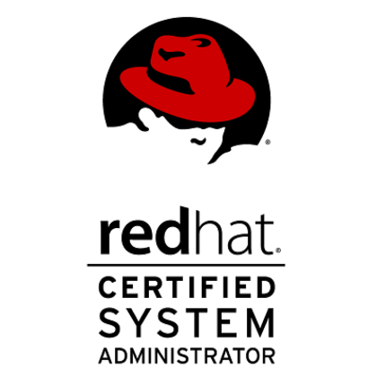
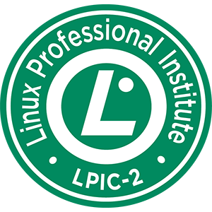
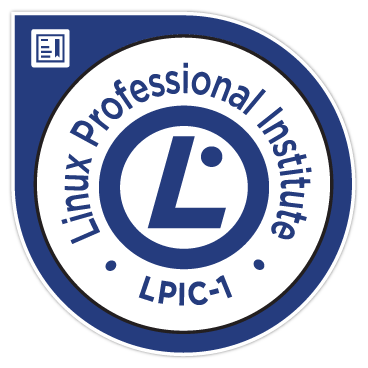

# Baha Eddine BOUKHZAR
* ✗ ⎈ Certified Kubernetes Administrator ⎈ 
* ✗ Certified Red Hat Certification System Administration II
* ✗ Certified Junior level Linux certification LPIC2
* ✗ Certified Junior level Linux certification LPIC1
* ✗ Cloud/ DevOps Engineer @Renault

<a target="_blank"  href="bahaeddine005@gmail.com">bahaeddine005@gmail.com</a>
| <a target="_blank"  href="https://about.me/bahaeddinebkz"> about me</a>

## Certifications

### CKA
`Avr 2019`

Certified Kubernetes Administrator
* License: CKA-1900-001733-0100

Click <a href="https://www.youracclaim.com/badges/5450373b-bc68-4c3e-84cd-5fb92c1fc9ec">here</a> to verify the certificate.

### LFS158x
`Oct 2017`

LFS158x: Introduction to Kubernetes
* License: d978a6fcd3ca488693dae1b5344f0297

Click <a href="https://courses.edx.org/certificates/d978a6fcd3ca488693dae1b5344f0297">here</a> to see certificate.

### RHCSA

`Oct 2016`

Red Hat Certified System Administrator
* License: 160-214-961 

Click <a href="https://www.redhat.com/rhtapps/certification/verify/?certId=160-214-961">here</a> to see certificate.

### LPIC 2

`Jan 2016`

Linux Professional Institue Certification Level 2
* License: LPI000280265

### LPIC 1

`Avr 2013`

Linux Professional Institue Certification Level 1
* License: LPI000280265