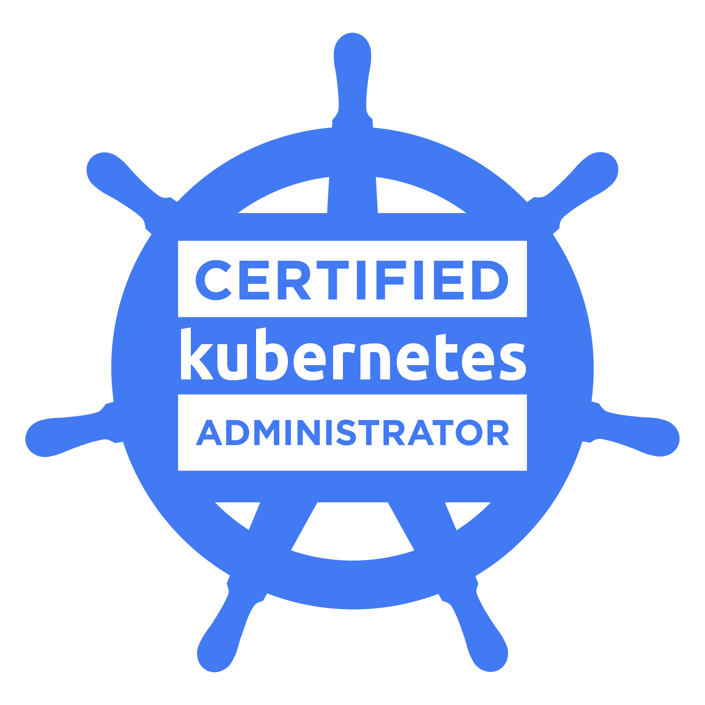
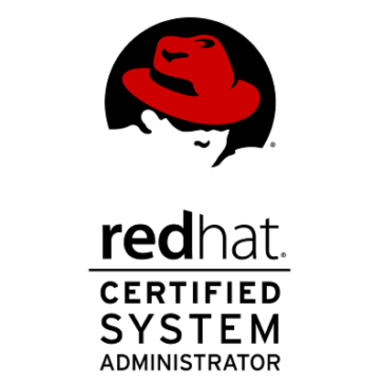
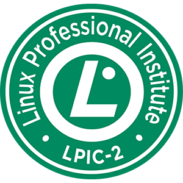
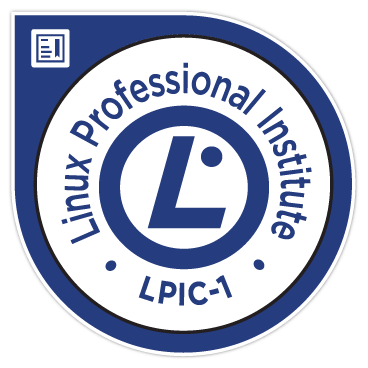

# Baha Eddine BOUKHZAR 
DevOps / Kubernetes / Docker / Google Cloud
* ✗ ⎈ Certified Kubernetes Application Developer ⎈
* ✗ ⎈ Certified Kubernetes Administrator ⎈
* ✗ Certified Red Hat Certification System Administration II
* ✗ Certified Junior level Linux certification LPIC2
* ✗ Certified Junior level Linux certification LPIC1
* ✗ Cloud/ DevOps Engineer @Renault

<a target="_blank"  href="bahaeddine.boukhzar@gmail.com">bahaeddine.boukhzar@gmail.com</a>
| <a target="_blank">   Paris</a>

## Currently

Today working as a Cloud/ DevOps Engineer at Renault. Certified Kubernetes Administrator, experienced also with CICD tools and Google Cloud Platform. Working in Cloud Transformation team at Renault, helping developers to move and transform their applications from Renault intranet Datacenter to the cloud using kubernetes, Docker, Helm, Gitlab-ci, Jenkins and a bunch of other DevOps tools.

Previously at Ingenico as a Continuous Integration expert, accompanying developers to automate the integration of code changes from multiple contributors into a single software project using Ansible, Jenkins, Bitbucket, Docker and a bunch of other DevOps tools.

## Education

`Juin 2015`

__Obtaining the National Engineering Degree in Computer Networks and Telecomunications__
- Tunis - INSAT, National Institute of Applied Sciences and Technology.

`2012-2015`

__Engineering studies in Computer Networks and Telecommunications specialized in Information System's Security__
- Tunis - INSAT, National Institute of Applied Sciences and Technology.

`2010-2012`

__Preparatory Studies Entrance to the Engineering Program__
- Tunis - INSAT, National Institute of Applied Sciences and Technology.

`2009-2010`

__Bachelor of Mathematics- with honors__
- Korba - Al Akhlak School

## Experiences

### Renault AITS
`Decembre 2018 - Now`

__As a Cloud and DevOps Engineer__
* ✗ Preparation and maintenance of the Kubernetes (GKE) infrastructure deployed on Google Cloud Platform (GCP).
* ✗ Leading the process of migrating approximately 1,000 applications to the public cloud. 
* ✗ Proposing and contributing to "production ready multi-tenant" Kubernetes architectures. 
* ✗ Migrating applications while adhering to the Cloud Native approach.

### Ingenico Group
`February 2018 - December 2018`

__As a Continuous Integration Expert__
* ✗ Setting up a continuous integration pipeline (Linux stack, Jenkins, Nexus, Docker, Vagrant, Maven/Gradle, Git) for embedded software in payment terminals and associated tools.
* ✗ Automating the migration of different projects (Java, Python, C) to a new Bitbucket platform through shell scripts.
* ✗ Migrating the Ingénico Build System from Vagrant to Docker. Creating a versioned Docker image that is used during continuous integration.
* ✗ Creating Jenkinsfiles and Dockerfiles for different Ingénico projects.
* ✗ Automating the deployment of the test infrastructure through Ansible playbooks (installation and update of Jenkins, Ingenico tools).
* ✗ Providing technical documentation to guide the implementation of continuous integration on Confluence.

### Paris-Dauphine University
`December 2017 - January 2018`

__As a DevOps Engineer__
* ✗ Development of a Shell script that automates the deployment of the Dauphine EBX solution in the Redhat test environment.
* ✗ Creating a Dockerfile that creates a tagged and versioned Docker image that will be automatically deployed in the test environment.
* ✗ Developing an Ansible script that installs and configures an Oracle database in a Redhat environment (system prerequisites, Oracle DB installation, instance creation).

### Sofrecom TUNISIA
`April 2016 - November 2017`

__As a Systems and Integration Engineer__
* ✗ Administering the different platforms of Orange Infra (Redhat servers).
* ✗ Ensuring the delivery of the 2017 Product Roadmap, Change Requests, and Bug Fixes. 
* ✗ Leading weekly meetings and integration tasks with all stakeholders.
* ✗ Leading network and system engineering tasks (opening flows, engineering files). 
* ✗ Ensuring the conduct of workshops and acceptance tests with Orange subsidiaries on site.

## Certifications

### CKA
`Avr 2019`

Certified Kubernetes Administrator
* License: CKA-1900-001733-0100

Click <a href="https://www.youracclaim.com/badges/5450373b-bc68-4c3e-84cd-5fb92c1fc9ec">here</a> to verify the certificate.

### LFS158x
`Oct 2017`

LFS158x: Introduction to Kubernetes
* License: d978a6fcd3ca488693dae1b5344f0297

Click <a href="https://courses.edx.org/certificates/d978a6fcd3ca488693dae1b5344f0297">here</a> to see certificate.

### RHCSA

`Oct 2016`

Red Hat Certified System Administrator
* License: 160-214-961 

Click <a href="https://www.redhat.com/rhtapps/certification/verify/?certId=160-214-961">here</a> to see certificate.

### LPIC 2

`Jan 2016`

Linux Professional Institue Certification Level 2
* License: LPI000280265

### LPIC 1

`Avr 2013`

Linux Professional Institue Certification Level 1
* License: LPI000280265
